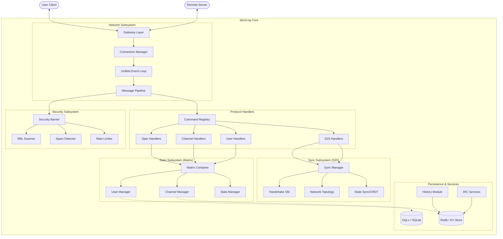

# slircd-ng System Architecture

A visual breakdown of the slircd-ng server architecture and its core subsystems.

## Subsystem Descriptions

| Subsystem | Core Responsibilities | Key Components |
|:----------|:----------------------|:---------------|
| **Network** | TCP/TLS termination, decoding, and event distribution. | `gateway.rs`, `event_loop.rs`, `dispatch.rs` |
| **State** | Global DI container and resource management (Users, Channels). | `matrix.rs`, `user_manager.rs`, `channel_manager.rs` |
| **Handlers** | Logic for individual IRC and S2S commands. | `src/handlers/`, `registry.rs` |
| **Sync** | TS6-compatible federation, topology tracking, and state propagation. | `sync/manager.rs`, `handshake.rs`, `topology.rs` |
| **Security** | Admission control, spam mitigation, and rate enforcement. | `security/rbl.rs`, `spam.rs`, `rate_limit.rs` |
| **Persistence** | Fast history storage and durable account/configuration state. | `db/`, `history/`, `persistence.rs` |
| **Services** | Network-level logic for NickServ and ChanServ. | `services/` |
